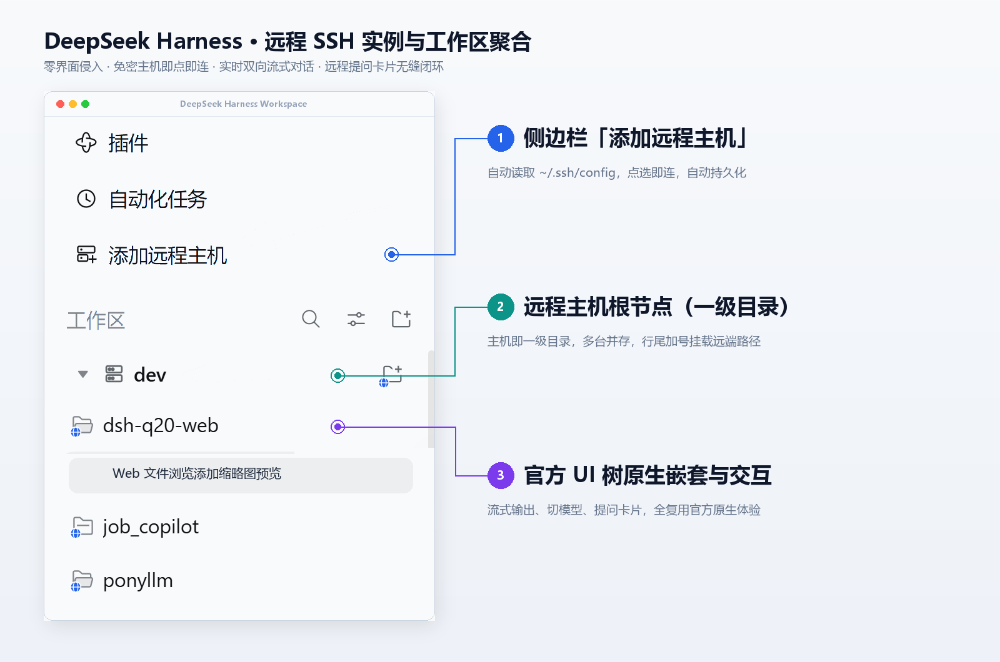

# dsh-plugin-remote-ssh

> 本地轻薄本负责貌美如花，远程工作站/服务器负责负重前行。  
> 经 SSH 隧道将远程 DSH 实例的工作区与会话“搬”进本地桌面端，完全无缝复用官方原生 UI。



---

## ✨ 它能干什么？

- **假装自己是本地的**：不整花哨的多余面板，远程工作区和会话直接潜伏在官方左侧工作区树里，折叠、展开、右键、状态指示灯与会话视图筛选（全部会话 / 仅显示已归档）原生可用，主机菜单稳定存活。
- **免密主机即插即用**：自动翻你本地的 `~/.ssh/config`，在侧边栏或设置面板点选即可一键接入，告别手动配端口的折磨。
- **全套双向交互**：打字机流式输出、实时取消、切换模型、新建/归档/置顶会话，连模型向你抛出提问卡片（`ask_user_question`）都能完美交互。
- **宿主机附件一键投递**：原生复用输入框 `+` 号菜单或直接拖拽，一键选取当前电脑（宿主机）上的文件、代码或图片上传给远程会话，经 SSH 隧道后台暂存与双向回读，无缝给远端模型喂资料。
- **自动打理与省心保活**：后台自动管隧道、换 Cookie、做预热与连接状态探测，网络断开自动指数退避重连。
---

## 🛠️ 准备工作

两边环境打个招呼：

1. **本地环境**：
   - 已安装 DeepSeek Harness 桌面客户端。
   - Node.js >= 18，pnpm >= 9。
   - 已配好 OpenSSH 密钥免密（`~/.ssh/config` 中有对应主机的 `Host` 与 `IdentityFile`；不支持键盘敲密码交互）。
2. **远程服务器**：
   - 具备 SSH 访问权限，且已启动 `dsh web` 服务（插件在建立连接前会探测远端服务存活，未启动时禁止连接并明确提示，不擅自拉起后台进程）。

---

## 🚀 三步装上它

### 1. 编译打包

在项目根目录下安装依赖并编译：

```bash
pnpm install
pnpm --filter dsh-plugin-remote-ssh build
```

### 2. 把插件挂载进桌面端

建立一个目录软链（Junction / Symlink），让 DSH 桌面端能找到它（本地开发改动即时生效，无需反复复制）：

- **Windows (PowerShell)**：
  ```powershell
  New-Item -ItemType Junction -Path "$env:USERPROFILE\.dsh\profiles\desktop\node_modules\dsh-plugin-remote-ssh" -Target "$PWD\packages\dsh-plugin-remote-ssh"
  ```
- **macOS / Linux**：
  ```bash
  ln -s "$(pwd)/packages/dsh-plugin-remote-ssh" "$HOME/.dsh/profiles/desktop/node_modules/dsh-plugin-remote-ssh"
  ```

### 3. 配置挂载项（防踩坑必读！）

打开 **Home 层** 配置文件 `$DSH_HOME/cordis.patch.yml`（通常位于 `~/.dsh/cordis.patch.yml`，没有则新建一个），追加如下内容：

```yaml
- insert:
    - id: remote-ssh
      name: "dsh-plugin-remote-ssh"
      config:
        remotePort: 3080
        localPort: 39387
```

> 💡 **避坑提示**：
> - **千万别写到 `profiles/desktop/cordis.patch.yml`**！桌面应用每次保存自身设置都会无情重写 profile 文件，手写的配置瞬间蒸发。请认准 **Home 层** `~/.dsh/cordis.patch.yml`。
> - 必须使用 `- insert:`，写成顶层 `- id:` 会被当成覆盖项静默跳过。
> - `config.host` 可以省略不写，启动时不锁死主机，直接在 UI 里动态选更灵活。

---

## 🎮 怎么用？

### 1. 接入远程主机
启动 DSH 桌面客户端：
- **快捷入口**：点击侧边栏导航区的「添加远程主机」按钮。
- **设置入口**：打开『设置 -> 远程主机聚合 (Remote SSH)』卡片。

下拉菜单会自动列出你 `~/.ssh/config` 里的免密主机，选一个点连接。成功后会自动存入 `$DSH_HOME/remote-ssh-hosts.json`，下次打开客户端自动重连，无需重复操作。

### 2. 操作远程工作区与会话
- **层级分明**：连上的主机在一级目录显示为服务器图标，其下嵌套远程工作区目录，会话排在第三层。
- **添加工作区**：在主机目录行右侧点专属的「添加工作区」小图标，就能挂载远端路径。
- **畅快对话与添加附件**：点进远程会话，打字、停机、切模型一气呵成；遇到确认提问时，输入框上方弹出选项卡；点击输入框 `+` 号选「文件」或直接把本机文件拖入输入框，宿主机文件即刻以附件草稿上传至远端供模型消费。

### 3. 命令行查状态（可选）
在聊天输入框随手敲一个 `/remote-ssh`，就能调出聚合状态面板，看眼当前的连接快照。

---

## 🧪 验证与冒烟测试

如果你修改了代码想确认一切正常，跑跑这些冒烟脚本：

```bash
# 验证前端 client 产物和代理管道（含附件拦截与命令通道）
node packages/dsh-plugin-remote-ssh/smoke-client-bundle.mjs

# 验证后端服务与路由契约
node packages/dsh-plugin-remote-ssh/smoke-host-apply.mjs

# 验证 SSH 配置解析逻辑
node packages/dsh-plugin-remote-ssh/smoke-ssh-config.mjs
```

---

## ⚠️ 坦白局（注意事项）

- **只认免密**：暂不支持交互式输密码，都用上远程开发了，顺手配个 SSH 密钥吧。
- **端口冲突**：默认转发本地 `39387`，要是被别的进程占了，在 `cordis.patch.yml` 里调一下 `localPort` 即可。
- **技术内幕**：想看完整的架构推演和决策流水？移步 [`.agents/notes/`](.agents/notes/)。
